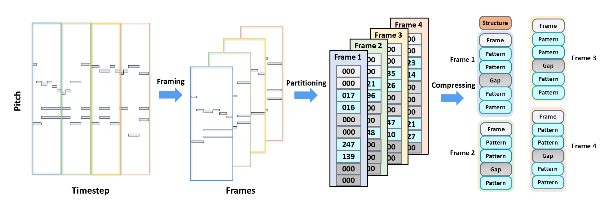

# PIANOROLL-EVENT: A Novel Score Representation for Symbolic Music

> **Update (October 2025)**: Demo Page

A clean, responsive project page for presenting **pianoroll-event** representation, audio/MIDI demos, figures, and videos.

---

## 📝 Abstract
Symbolic music representation is a fundamental challenge in computational musicology. While grid-based representations effectively preserve pitch-time spatial correspondence, their inherent data sparsity leads to low encoding efficiency. Discrete-event representations achieve compact encoding but fail to adequately capture structural invariance and spatial locality. To address these complementary limitations, we propose Pianoroll-Event, a novel encoding scheme that describes pianoroll representations through events, combining structural properties with encoding efficiency while maintaining temporal dependencies and local spatial patterns. Specifically, we design four complementary event types: Frame Events for temporal boundaries, Gap Events for sparse regions, Pattern Events for note patterns, and Musical Structure Events for musical metadata. Pianoroll-Event strikes an effective balance between sequence length and vocabulary size, improving encoding efficiency by 1.36× to 7.16× over representative discrete sequence methods. Experiments across multiple autoregressive architectures show models using our representation consistently outperform baselines in both quantitative and human evaluations.

  

## ✨ What's New
- Modern, responsive layout (Bulma) with accessible typography
- Built-in **MIDI player + visualizer** (piano-roll / staff)
- Image & video sections with optional carousel
- Better performance (lazy loading, smaller assets)
- Copy-ready BibTeX block with “Copy” button (optional JS)
- SEO & social sharing meta tags

---

